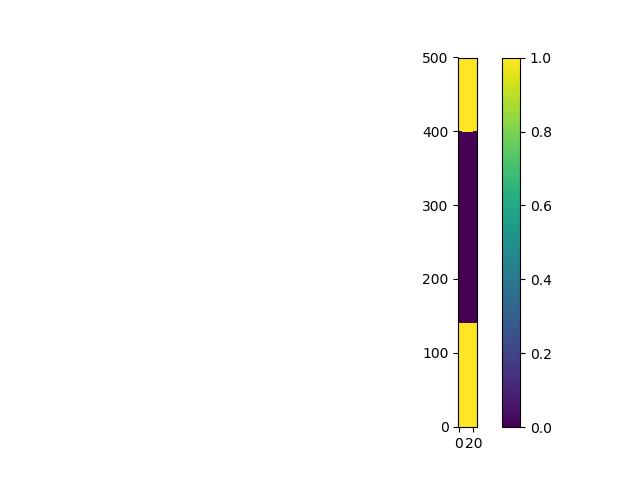

# OpenLBMPM (In development)
OpenLBMPM is an open source lattice Boltzmann method (LBM) package for multicomponent and multiphase (MCMP) flow and transport in porous media. Currently, it includes Shan-Chen method and color gradient method for MCMP system. The transport part does not include any chemical reactions and phase change, but they will be added later. 

D2Q9 and D3Q19 schemes are implemented to simulate fluid flow in 2D and 3D. To balance the accuracy and efficiency, D2Q5 and D3Q7 schemes are used to simulate the transport phenomena. 

There are two options for Shan-Chen method: (1) Original Shan-Chen method, which integrates the force term to the equilibrium velocity and cannot reach high viscosity ratio; (2) Explicit forcing model developed by M.Porter et al (2012), which is able to reach high viscosity ratio with the different isotropy values  (M~1000). The last one has multi-relaxation-time collision operators to suppress spurious currents and keep numerical stability. For color gradient model, the methods developed by Liu et.al (2014), Huang et al (2014) and Takashi et al (2018) are included here. All of them have MRT collision operator option. 

# Required packages
OpenLBMPM is accelerated by GPU parallel computation, so it needs several supporting packages:

1. [CUDA](https://developer.nvidia.com/cuda-downloads)
2. [Anaconda-python3.6](https://www.anaconda.com/download/#linux)

# How to use the codes
So far, there is no need to install this package and the codes are tested under the Linux environmenta (Kubuntu  16.04LTS). To run the simulation. Inputting 'python main.py' under the directory of OpenLBMPM will start the simulation. Then you can choose which kind of MCMP LBM is needed. The details on how to set up and run a simulation are shown below:
1. Use git clone to get the copy of this packaged
2. Set up the environmental variables in .bashrc (e.g., export PYTHONPATH=$PYTHONPATH:/PATH/PACKAGE/RKCG2D) for all LBM methods
3. Set up the geometry of the simulated domain in the file SimpleGeometry.py, which is usually not complicated or add the pore structure image to the designated folder (/home/$USER/StructureImage/)
4. Set up fluid properties, boundary conditions, and simulation time in the .ini file from the folder IniFiles.
5. Input python main.py to run the simulation

# Structure of the folder for results
When the script, main.py, starts to run, it checks whether there is a folder called 'LBMResults' existing or not. If not, the new folder is created automatically. Then all the results from the simulation are saved in this folder. The structure of this folder is:

'''

├── LBMResults

    ├──FluidsBDistributionAt0000%d.png
    ├──FluidsRdistributionAt0000%d.png
    ├──SimulationResultsRK.h5   
'''

.png files are shown the distribution of each fluid at a certain time step. .h5 file stores the densities and distribution functions of each fluid and the velocities in each direction. This file can be easily read using tables or h5py.

# Types of boundary conditions
1. Contant pressure
2. Constant velocity
3. Convective boundary (only for the outlet)
4. Half-bounce back

Constant pressure/velocity boundaries are implemented following Zou and He. The convective boundary is only the outlet of the simulated domain and it is equivalent to the free flux boundary condition. Half-bounce back boundary condition is for no-slip boundary between fluid and solid surface, which is an advantage of LBM to simulate flow and transport in pore space.

**Buffering Layer:** *When fluid flow in pore structure is simulated, it is better to extend the simulated domain on the flow direction with a certain number of 'buffering layers' for minimizing the influence of boundaries.* 

# Type of MCMP LBM in this package
1. Original Shan-Chen model
2. Explicit force scheme model
3. Color gradient LBM 
4. CSF-color gradient LBM (The best option)

# Examples
## Contact angle
Here the examples of contact angle from method 4 are shown. Compared to the other methods, this one can reach more accurate contact angle value without having unphysical mass diffusion layer on the solid phase surface. The contact angles are: (1) 150 degree; 

## Capillary Intrusion
This is the example of capillary intrusion and the viscosity ratio here is 0.01 

## Drainage process
This is the example of drainage process in pore space

